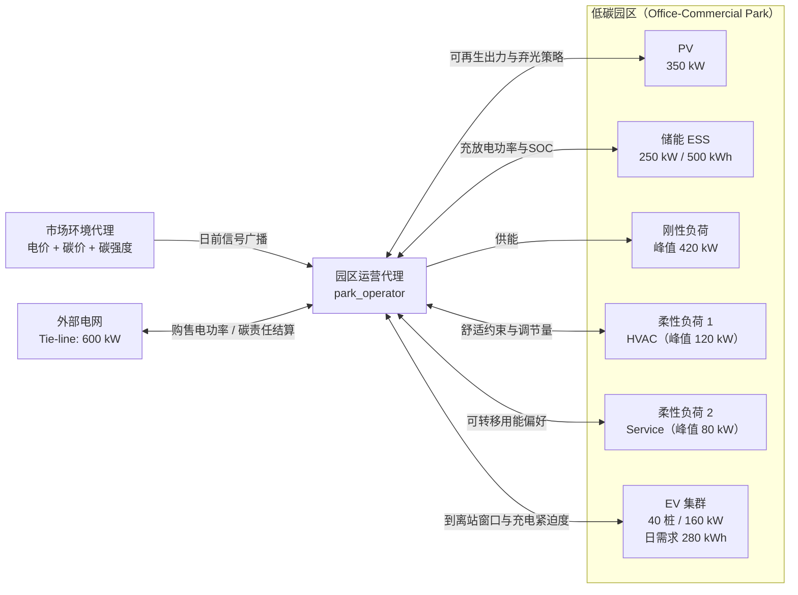
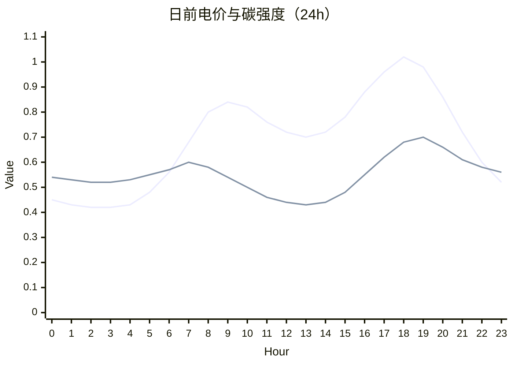
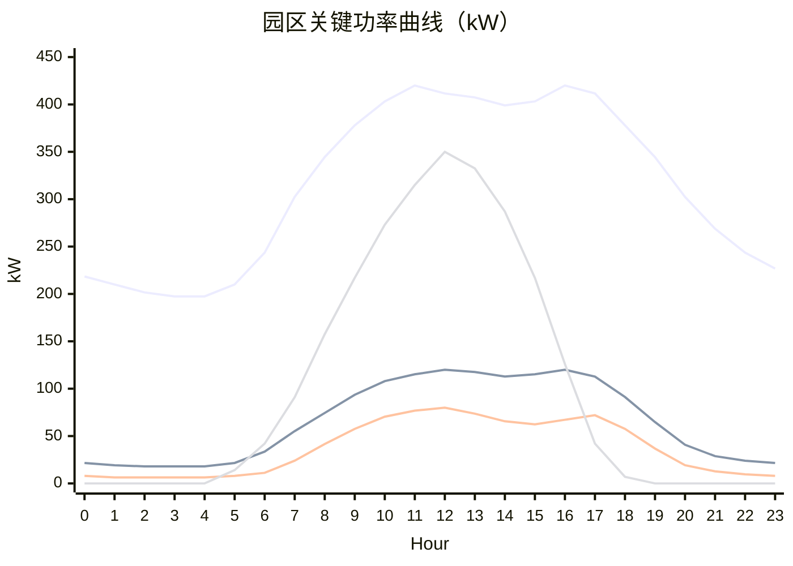

# 园区结构与实验场景可视化（草稿）

> 用于 `case_study` 内部讨论，暂不接入论文主文档。

## 1) 园区结构图（能量-碳-控制关系）

## 2) 实验场景图（24h 日前时序）

### 2.1 价格与碳信号

### 2.2 园区主要功率曲线（供给与需求）

### 2.3 EV 场景窗口（到离站约束）

```mermaid
gantt
    title EV 停车与可调度充电窗口
    dateFormat  HH
    axisFormat  %H:00
    section EV Cluster
    Parking & Chargeable :active, 07, 11h
```

## 3) 快速解读（可作为图注素材）

- 研究对象是单联络线园区，外部交互受 `600 kW` 约束。
- 园区内部资源含 `PV + ESS + 刚性负荷 + 两类柔性负荷 + EV`，由统一运营代理协调。
- 典型工作日下，`10:00-17:00` 光伏可显著覆盖园区负荷，`17:00-20:00` 进入高电价高碳强度时段。
- EV 在 `07:00-18:00` 内可调度，适合与光伏时段和储能策略联合优化。
